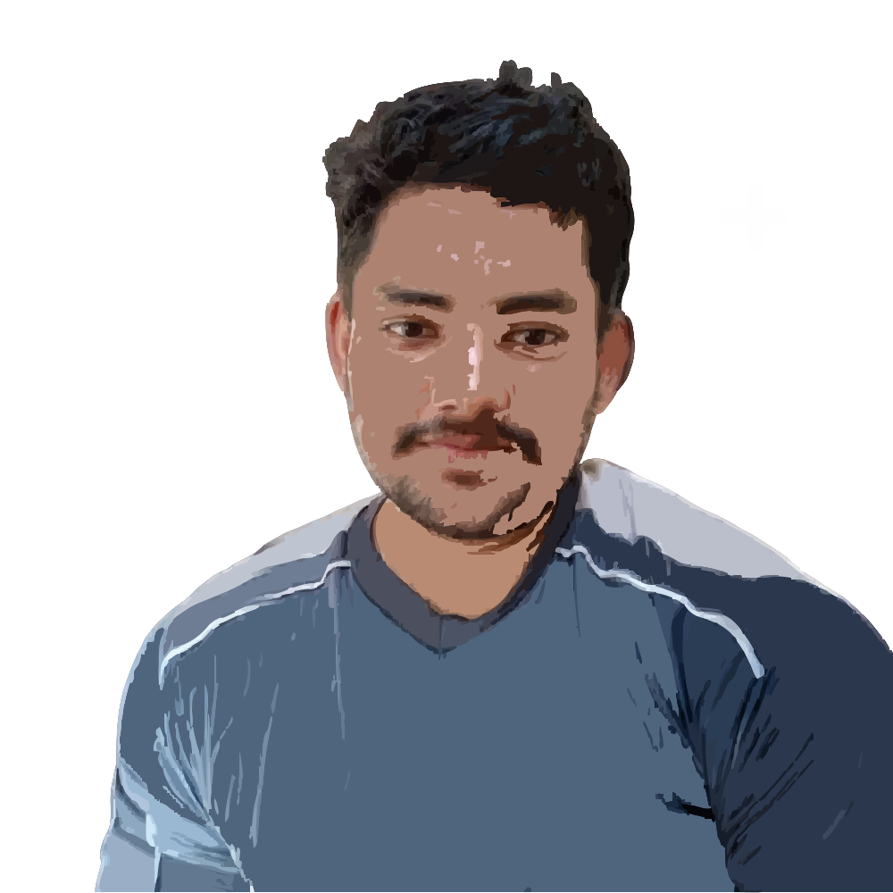

#  Muhammad Adnan – Developer Portfolio

Hey 👋 I’m **Muhammad Adnan** — a **full-stack developer & WhatsApp marketing expert** passionate about building **clean**, **fast**, and **user-friendly** digital experiences.  
This is my personal portfolio built with **Next.js**, showcasing my **work**, **skills**, and **ways to connect** with me.

---

## ✨ Features

* ⚡ **Blazing fast** development & production builds with [Next.js](https://nextjs.org/)
* 📱 **Responsive design** across mobile, tablet, and desktop
* 🔍 **SEO optimized** with `next/metadata`, sitemap, robots.txt & Open Graph tags
* 🎨 **Modern & minimal UI** powered by Tailwind CSS
* 🌙 **App Router + Server Components** for better performance
* 📦 **Icons & UI** with [Lucide React](https://lucide.dev/)

---

## 🛠 Tech Stack

**Core:** Next.js (App Router) · React · TypeScript · Tailwind CSS  
**UI & Icons:** Lucide React  
**SEO & Performance:** Next.js Metadata API · Sitemap · Robots.txt  

---

## 🚀 Quick Start

Clone the repository:

```bash
git clone https://github.com/oymusafir/myportfolio-nextjs.git
````

Navigate into the folder:

```bash
cd myportfolio
```

Install dependencies:

```bash
npm install
```

Run the development server:

```bash
npm run dev
```

Build for production:

```bash
npm run build
npm run start
```

---

## 📬 Contact Me

If you’re interested in working together or just want to connect:

* **Website**: [muhammadadnan.dev](https://muhammadadnan.dev)
* **Email**: [oymusafir@email.com](mailto:oymusafir@email.com)
* **LinkedIn**: [linkedin.com/in/oymusafir](https://linkedin.com/in/oymusafir)
* **GitHub**: [github.com/oymusafir](https://github.com/oymusafir)
* **WhatsApp**: [wa.me/923424590618](https://wa.me/923424590618)

---

## 📜 License

This project is licensed under the **MIT License** — feel free to fork, customize, and build your own portfolio.
